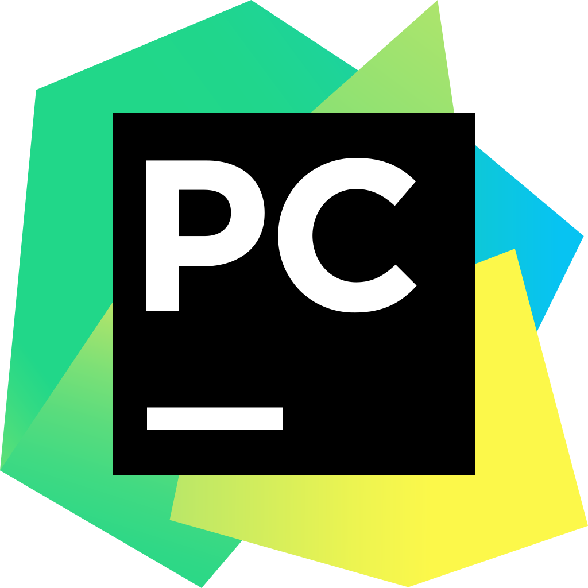

# TicTacToe-PythonGame
A GUI Version of tic tac toe game in python.

### Languages & tools :
[][python]
[][python]
  
 

|Python Tic tac toe Game| Python Tic tac toe Game |
|------|-------|
|||

### Directory Structure :
    |-- Tic tac toe
    |    |-- 3T.py
    |    |-- README.md
    |
    |-- Img
    |    |-- pycharm.png
    |    |-- python.png
    |    |-- pythonTicTacToe1.png
    |    |-- pythonTicTacToe2.png
    |
    |-- README.md

### Connect with me :  

  
 

[python]:https://github.com/AbhilashTUofficial/Python-programming
